

# Wine Quality Classification with Cost-Sensitive Evaluation

## Problem Definition
.
A growing winery aiming to expand into international markets faces a critical decision challenge: how to reliably identify which wines should be positioned as premium products.

Premium wines represent a significant opportunity for the business. They are sold at higher prices, packaged differently, and contribute directly to both profitability and brand reputation. In contrast, standard wines are sold with minimal margins and play a more operational role in the product portfolio.

However, the company currently lacks access to sommeliers or expert evaluators to assess wine quality before commercialization. This creates a risk in the decision process:

- If a high-quality wine is classified as standard, the company misses a potential revenue opportunity.
- If a low-quality wine is classified as premium, the consequences are substantially more severe: customer dissatisfaction, potential returns of entire batches, and reputational damage in new markets.

To address this, the company relies on historical laboratory data, where wines were evaluated by experts and assigned quality scores based on physicochemical properties such as acidity, pH, and alcohol content.

The objective of this project is to develop a predictive model that supports this classification decision in a consistent and scalable way. Unlike traditional classification problems, this scenario requires explicitly accounting for the **asymmetric cost of errors**, where false positives (incorrectly labeling a low-quality wine as premium) are significantly more costly than false negatives.

Additionally, the classification decision is not fixed: it depends on selecting an appropriate decision threshold, which directly impacts in the decision whether to prioritize capturing premium opportunities and avoiding costly mistakes. 

This project therefore approaches the problem as a **cost-sensitive classification task**, where model performance is evaluated not only through statistical metrics, but through its impact on business outcomes.
.

> **Note:** This is a simulated business case designed to reflect real-world decision-making scenarios.

## Business Objective

The goal of this project is not only to classify wines correctly, but to maximize business value by explicitly accounting for the cost of different types of prediction errors.

To reflect real-world decision making, a cost matrix is defined:

<table>
  <tr>
    <th>Outcome</th>
    <th>Description</th>
    <th>Value</th>
  </tr>
  <tr>
    <td>True Positive</td>
    <td>High-quality wines correctly classified as premium</td>
    <td>+5</td>
  </tr>
  <tr>
    <td>True Negative</td>
    <td>Low-quality wines correctly classified as standard</td>
    <td>+1</td>
  </tr>
  <tr>
    <td>False Positive</td>
    <td>Low-quality wines incorrectly classified as premium</td>
    <td>-10</td>
  </tr>
  <tr>
    <td>False Negative</td>
    <td>High-quality wines incorrectly classified as standard</td>
    <td>0</td>
  </tr>
</table>

This cost structure reflects that incorrectly labeling a low-quality wine as premium is significantly more damaging than missing a high-quality opportunity.

As a result, the objective is to develop a model that optimizes decision-making, prioritizing the reduction of costly false positives while still capturing valuable premium wines.

## Dataset Overview

The dataset used in this project was sourced from an academic institution and contains physicochemical measurements of wine samples, each evaluated and assigned a quality score by expert tasters.
<table>
  <tr><th>Property</th><th>Value</th></tr>
  <tr><td>Observations</td><td>~4600</td></tr>
  <tr><td>Features</td><td>11 physicochemical variables</td></tr>
  <tr><td>Target variable</td><td>Quality score (3–9)</td></tr>
  <tr><td>Source</td><td>Academic dataset</td></tr>
</table>

<table>
  <tr>
    <th>Feature</th>
    <th>Description</th>
  </tr>
  <tr>
    <td>fixed.acidity</td>
    <td>Non-volatile acids in the wine</td>
  </tr>
  <tr>
    <td>volatile.acidity</td>
    <td>Amount of acetic acid, linked to vinegar taste</td>
  </tr>
  <tr>
    <td>citric.acid</td>
    <td>Adds freshness and flavor</td>
  </tr>
  <tr>
    <td>residual.sugar</td>
    <td>Sugar remaining after fermentation</td>
  </tr>
  <tr>
    <td>chlorides</td>
    <td>Salt content in the wine</td>
  </tr>
  <tr>
    <td>free.sulfur.dioxide</td>
    <td>Free form of SO₂, acts as antimicrobial</td>
  </tr>
  <tr>
    <td>total.sulfur.dioxide</td>
    <td>Total SO₂, indicator of preservation</td>
  </tr>
  <tr>
    <td>density</td>
    <td>Mass per unit volume</td>
  </tr>
  <tr>
    <td>pH</td>
    <td>Acidity level on a 0–14 scale</td>
  </tr>
  <tr>
    <td>sulphates</td>
    <td>Additive that contributes to SO₂ levels</td>
  </tr>
  <tr>
    <td>alcohol</td>
    <td>Percentage of alcohol by volume</td>
  </tr>
  <tr>
    <td>quality</td>
    <td>Expert rating from 3 to 9 (target variable)</td>
  </tr>
</table>

## Exploratory Data Analysis

### Target Variable Distribution
The quality scores are heavily concentrated around values 5 and 6, which together account for the vast majority of observations. Scores at the extremes — 3, 4, 8, and 9 — are significantly underrepresented, reflecting the natural difficulty of producing wines at the quality boundaries.

  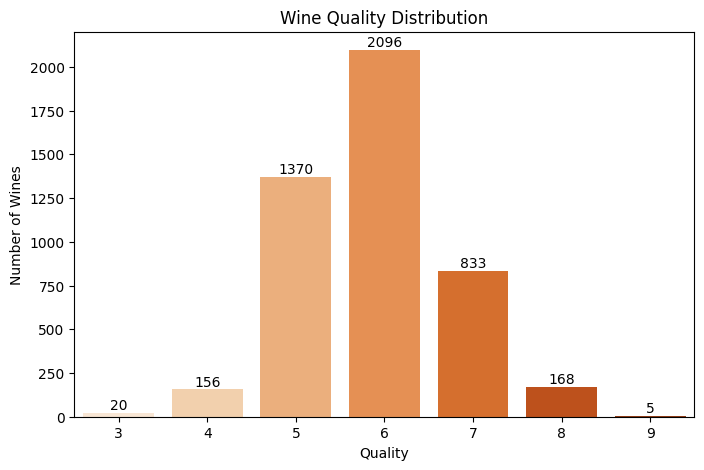

This concentration has a direct implication for the modeling phase: once the target is transformed into a binary label, the resulting class distribution is notably imbalanced, with Low quality wines representing approximately 78% of the dataset. Standard accuracy metrics are therefore insufficient to evaluate model performance in this context.

### Feature Correlations

  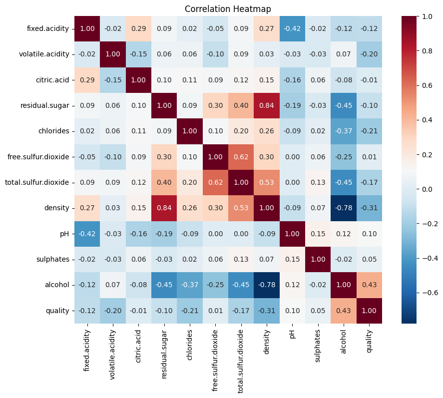

The heatmap reveals several relevant relationships. Alcohol shows the strongest positive correlation with quality (0.43), suggesting that higher alcohol content tends to be associated with better-rated wines. On the other hand, density presents a notable negative correlation (-0.31), which is partly explained by its strong inverse relationship with alcohol (-0.78).
Two pairs of variables also show signs of multicollinearity worth noting: residual sugar and density (0.84), and free sulfur dioxide and total sulfur dioxide (0.62). This was taken into account during the modeling phase, particularly for Logistic Regression, which is sensitive to correlated features.

### Key Variable Relationships
As part of the exploratory analysis, pairwise relationships between all variables were examined. The following plots focus on two relationships that stood out due to their strong correlation and the presence of extreme observations.

  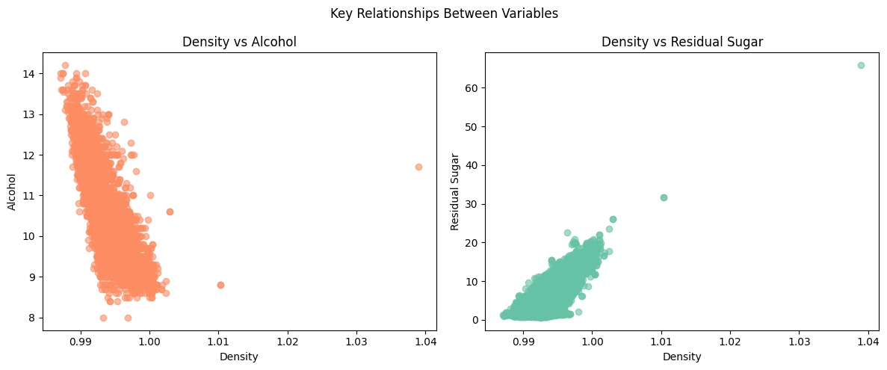

The plots reveal clear directional relationships between the variables, but also expose a small number of extreme observations positioned far from the main data cluster — particularly visible in the Density vs Residual Sugar plot. These findings motivated the outlier treatment applied in the following data preparation phase.

## Data Preparation

Before training the models, several preprocessing steps were applied to improve data quality and ensure the dataset was suitable for modeling.

### Outlier Treatment

  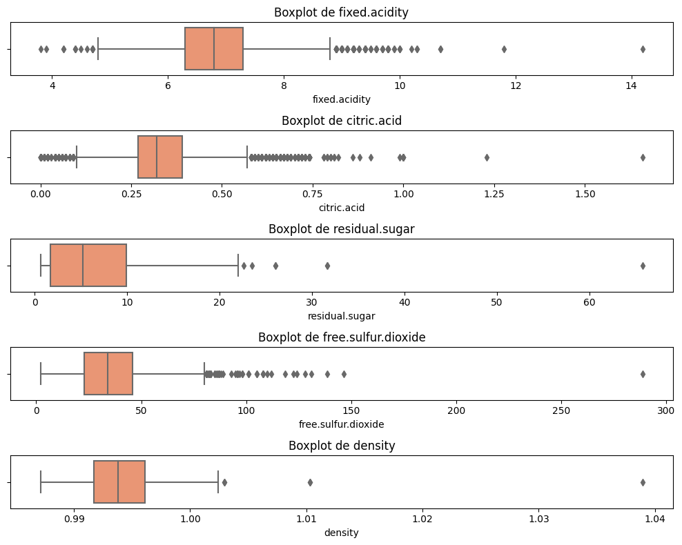

Outliers were identified through boxplot analysis and confirmed visually using the scatterplots discussed in the previous section. Rather than applying aggressive transformations such as clipping, a targeted filtering approach was chosen: upper thresholds were defined for five variables — fixed.acidity, citric.acid, residual.sugar, free.sulfur.dioxide, and density — removing only the most extreme observations while preserving the overall data structure.

The impact of this treatment is visible in the plot below, where the most extreme values are significantly reduced while the overall structure of each variable is preserved.

  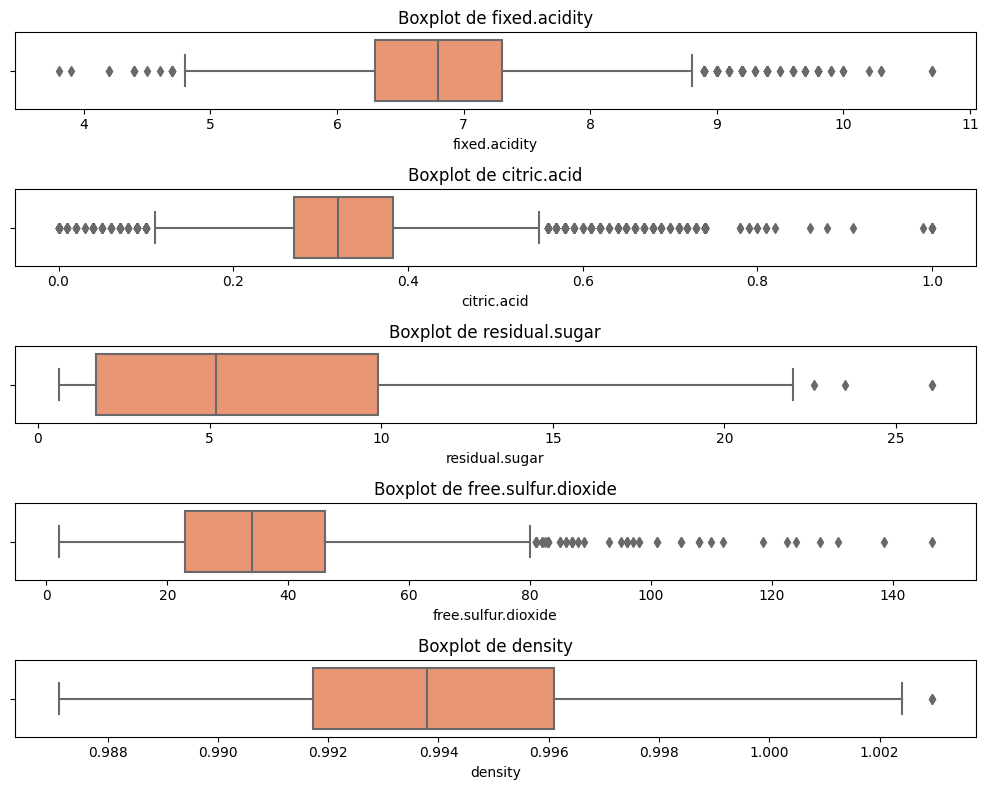

### Feature Transformation
Two variables — chlorides and residual sugar — showed highly skewed distributions with long right tails. A logarithmic transformation was applied to both in order to reduce skewness and stabilize variance. The effect of this transformation is illustrated below using residual sugar as an example.

  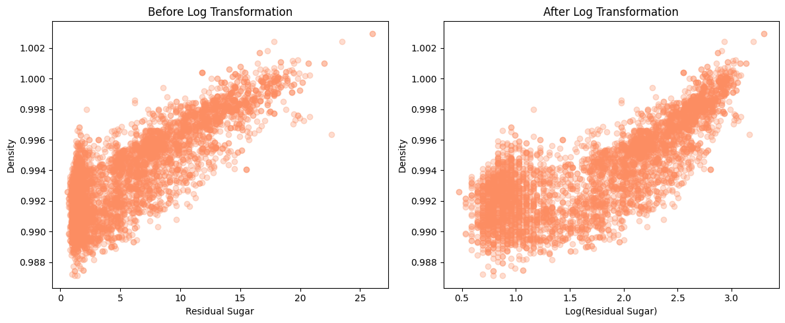

While the relationship does not become strictly linear, the transformed feature exhibits a more balanced and stable structure, which is particularly beneficial for models sensitive to feature scale such as Logistic Regression.

### Feature Engineering
A new feature was created by computing the ratio between alcohol and density. Given the strong relationship between these two variables identified during the EDA, this engineered feature aims to capture their joint effect in a single, more informative variable.

### Feature Correlation with Target
After completing the preprocessing steps, the correlation between each feature and wine quality was recalculated to assess the impact of the transformations and confirm the relevance of the engineered feature.

  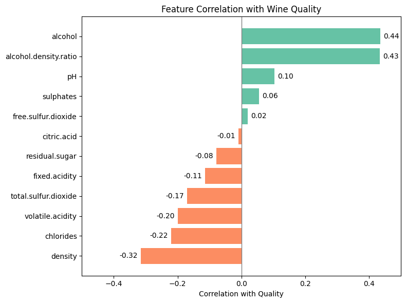

Alcohol and the engineered alcohol.density.ratio show the strongest positive correlations with quality (0.44 and 0.43 respectively), confirming that the new feature captures information almost as effectively as alcohol alone. On the negative side, density, chlorides, and volatile.acidity present the strongest inverse relationships with quality.

### Target Variable Definition
As a final step before modelling, the original quality score was transformed into a binary classification label to align the problem with the business objective.

  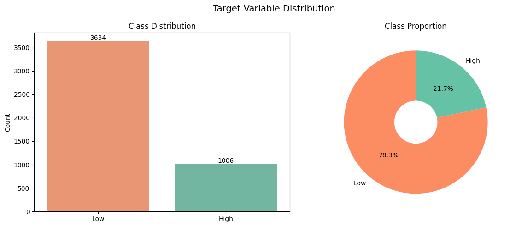

Wines with a score greater than 6 were labeled as High quality (1,006 observations, 21.7%), while the rest were classified as Low quality (3,634 observations, 78.3%). This confirms the class imbalance anticipated during the exploratory analysis, reinforcing the need for cost-sensitive evaluation and threshold optimization in the modeling phase.

## Modeling Approach

The core challenge of this project is not just predicting wine quality correctly, but avoiding a specific type of error: classifying a low-quality wine as premium. This mistake carries the highest business cost — potential returns, customer dissatisfaction, and reputational damage in new markets.
For this reason, three classification models were evaluated — Logistic Regression, Random Forest, and XGBoost — all optimized around precision, the metric that directly controls the rate of false positives. Hyperparameter tuning was performed using GridSearchCV with Stratified K-Fold cross-validation, and the classification threshold was adjusted for each model to further reduce costly misclassifications.

### Logistic Regression
Logistic Regression was used as the baseline model. Its primary role is to establish a reference point — a minimum performance bar that more complex models should comfortably exceed.
While the model shows reasonable ability to separate both classes (ROC AUC: 0.8123), its precision on the test set reached only 0.5651, meaning that nearly 1 in 2 wines predicted as premium were actually standard. With 117 false positives, this level of error would translate directly into costly misclassifications under the defined cost structure.

  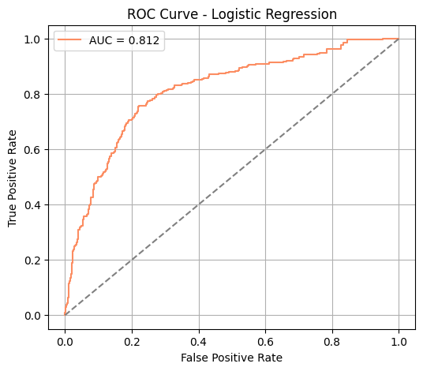

### Random Forest
Random Forest introduced a significant improvement over the baseline. As an ensemble model capable of capturing non-linear relationships between variables, it proved particularly well-suited for this problem, where wine quality is influenced by multiple interacting physicochemical properties.
The results on the test set reflect this strength: with a precision of 0.9050, only 17 wines were incorrectly classified as premium out of all positive predictions. This represents a dramatic reduction in false positives compared to Logistic Regression, directly translating into lower business risk and higher profit under the defined cost structure.

  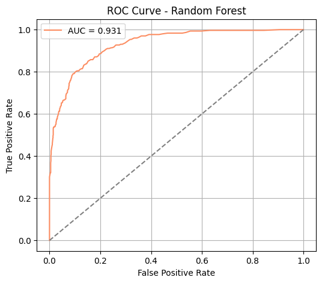

The profit vs threshold curve below identifies the classification threshold that maximizes business value. The optimal threshold of 0.55 yields a profit of 1,714 — confirming that a more conservative threshold significantly outperforms the default of 0.5 in this cost-sensitive context.

  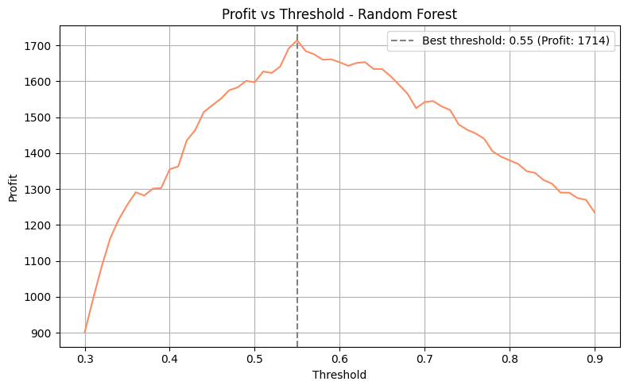

### XGBoost
XGBoost was evaluated as a boosting-based alternative to determine whether it could further improve upon Random Forest. While it delivers strong overall performance and actually identifies more true premium wines than Random Forest (172 vs 162), this comes at a cost: 42 false positives compared to just 17.
In a standard classification problem, identifying more true positives would be a clear advantage. However, in this business context, where a single false positive carries twice the penalty of a true positive reward, the additional misclassifications reduce its overall value significantly.

  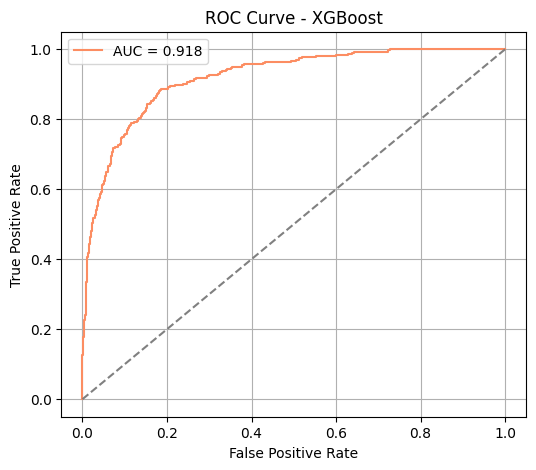

Applying the same optimization approach, XGBoost reaches its peak profit of 1,584 at a threshold of 0.73 — considerably higher than the default, reflecting the model's need for a much more conservative decision boundary to control false positives effectively.

  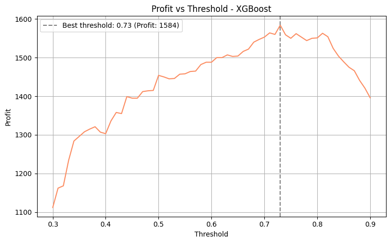

### Model Comparison

With all three models evaluated, the results can be compared directly. The ROC curve below illustrates the overall discrimination ability of each model across all possible thresholds.

  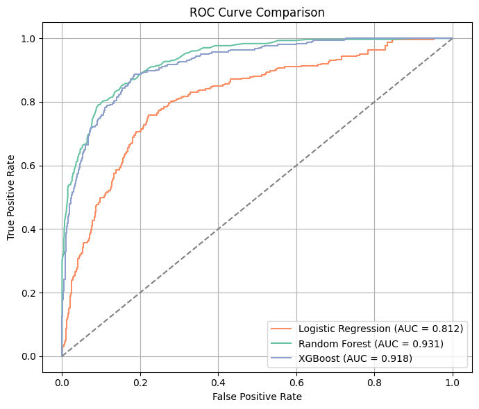

The gap between Logistic Regression and the two ensemble models is clear. Random Forest and XGBoost both achieve substantially stronger separation between classes, confirming that the added complexity of ensemble methods is justified in this context.
n/

<table>
  <tr>
    <th>Model</th>
    <th>Precision</th>
    <th>Recall</th>
    <th>F1-Score</th>
    <th>PR AUC</th>
    <th>ROC AUC</th>
  </tr>
  <tr>
    <td>Logistic Regression</td>
    <td>0.5651</td>
    <td>0.5033</td>
    <td>0.5324</td>
    <td>0.5528</td>
    <td>0.8123</td>
  </tr>
  <tr>
    <td>Random Forest</td>
    <td><strong>0.9050</strong></td>
    <td>0.5364</td>
    <td><strong>0.6736</strong></td>
    <td><strong>0.8287</strong></td>
    <td><strong>0.9312</strong></td>
  </tr>
  <tr>
    <td>XGBoost</td>
    <td>0.8037</td>
    <td><strong>0.5695</strong></td>
    <td>0.6667</td>
    <td>0.7916</td>
    <td>0.9185</td>
  </tr>
</table>

Random Forest leads in precision and both AUC metrics, making it the strongest candidate from a predictive standpoint. XGBoost trades some precision for higher recall — a reasonable choice in other contexts, but not in this one given the asymmetric cost structure.

## Cost-Sensitive Evaluation
Predictive metrics alone do not tell the full story. The real question is: what is the business impact of each model's errors?
To answer this, a cost matrix was applied to translate prediction outcomes into business value:
<table>
  <tr>
    <th>Outcome</th>
    <th>Business Meaning</th>
    <th>Value</th>
  </tr>
  <tr>
    <td>True Positive</td>
    <td>High-quality wine correctly classified as premium</td>
    <td>+5</td>
  </tr>
  <tr>
    <td>True Negative</td>
    <td>Low-quality wine correctly classified as standard</td>
    <td>+1</td>
  </tr>
  <tr>
    <td>False Positive</td>
    <td>Low-quality wine incorrectly classified as premium</td>
    <td>-10</td>
  </tr>
  <tr>
    <td>False Negative</td>
    <td>High-quality wine missed</td>
    <td>0</td>
  </tr>
</table>
Applying this structure to each model's results:
<table>
  <tr>
    <th>Model</th>
    <th>TN</th>
    <th>FP</th>
    <th>FN</th>
    <th>TP</th>
    <th>Profit</th>
  </tr>
  <tr>
    <td>Logistic Regression</td>
    <td>973</td>
    <td>117</td>
    <td>150</td>
    <td>152</td>
    <td>563</td>
  </tr>
  <tr>
    <td>Random Forest</td>
    <td>1073</td>
    <td>17</td>
    <td>140</td>
    <td>162</td>
    <td><strong>1713</strong></td>
  </tr>
  <tr>
    <td>XGBoost</td>
    <td>1048</td>
    <td>42</td>
    <td>130</td>
    <td>172</td>
    <td>1488</td>
  </tr>
</table>

  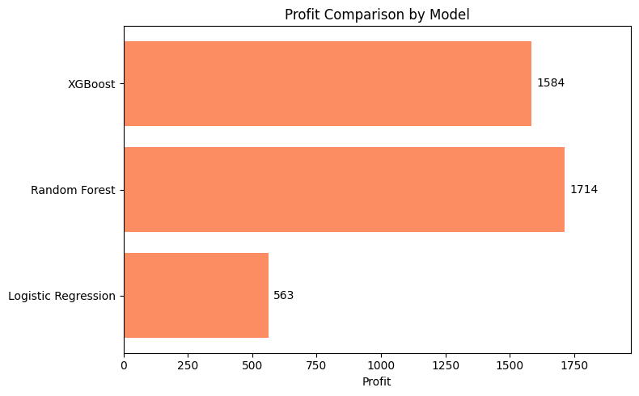

The numbers tell a clear story. Logistic Regression's 117 false positives alone generate a penalty of -1,170, severely limiting its business value despite identifying a reasonable number of true premium wines. XGBoost finds more premium wines than Random Forest, but its 42 false positives cost -420, eroding much of that advantage. Random Forest, with only 17 false positives, keeps that penalty to just -170 — making it the most profitable model by a significant margin.

## Conclusion
This project set out to solve a real business problem: helping a winery reliably identify premium wines without relying on expert evaluators, while explicitly accounting for the cost of getting it wrong.
The results show that not all correct predictions are equal. XGBoost identified more premium wines than Random Forest, but its higher rate of false positives — incorrectly labeling standard wines as premium — made it a more costly choice for the business. Random Forest, by keeping false positives to a minimum, delivered the highest profit of the three models evaluated (1,713 vs 1,488 for XGBoost and 563 for Logistic Regression).
This outcome reinforces a key principle in applied machine learning: the best model is not always the one with the highest accuracy or the most positive predictions. In contexts where errors carry asymmetric costs, aligning model evaluation with business objectives is what ultimately determines real-world value.
